# Inteligência Empresarial | Transformando dados - Etapa 1

## 📈 Estratégias e tecnologias utilizadas
- LLM escolhida: Github Copilot
- Tecnologias utilizadas: Python, Pandas, Matplotlib, Seaborn, Google Colab

## ⌛ Tempo gasto para produzir os resultados

1. Construção das tabelas e consultas: **aproximadamente 15 minutos**

2. Criação dos gráficos e análise dos dados: **aproximadamente 1h e 25 minutos**

3. Tempo total gasto: 1h e 40 minutos

## 📊 Análise dos dados

1. Quem são os 10 maiores clientes em termos de vendas ($)?

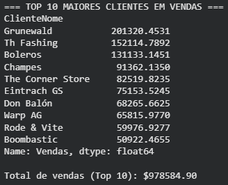

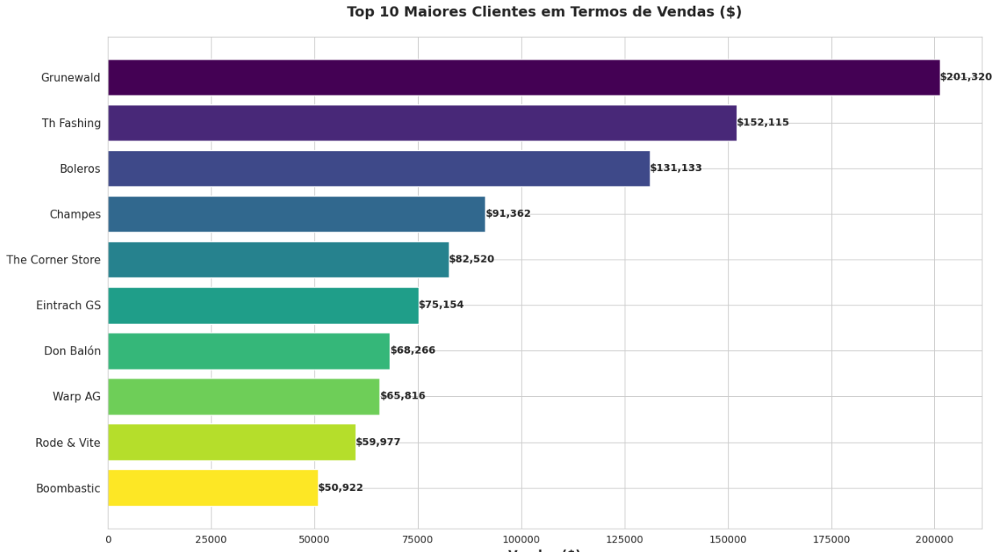

2. Quais os três maiores países em termos de vendas ($)?

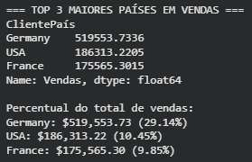

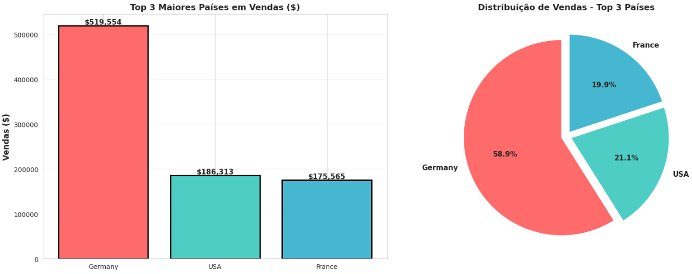

3. Quais as categorias de produtos que geram maior faturamento (vendas $) no Brasil?

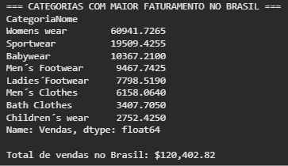

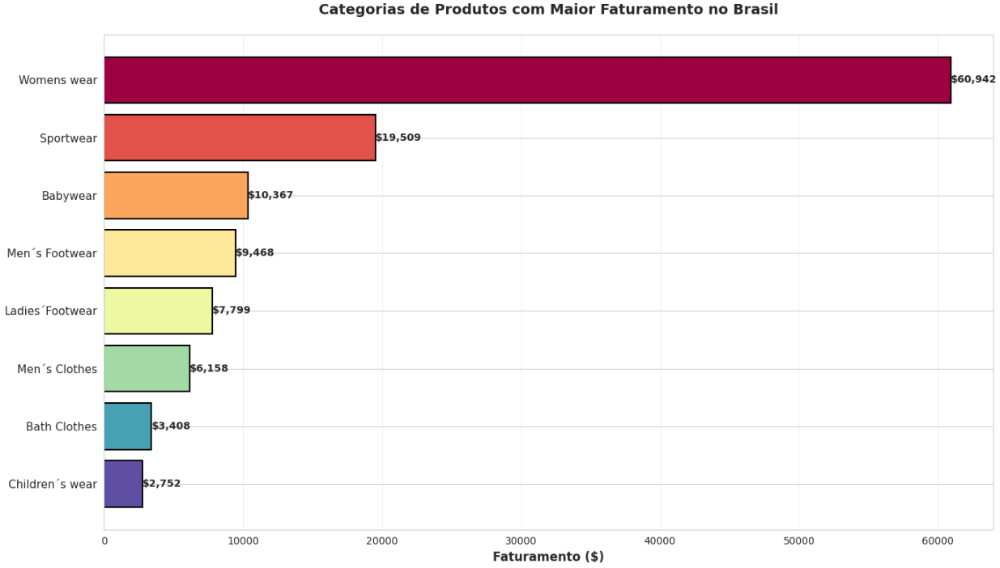

4. Qual a despesa com frete envolvendo cada transportadora?

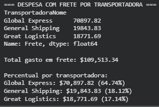

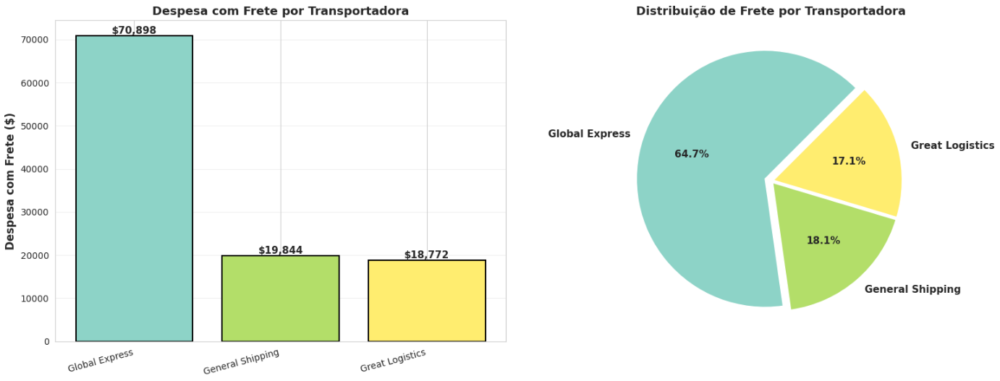

5. Quais são os principais clientes (vendas $) do segmento "Calçados Masculinos" (Men´s Footwear) na Alemanha?

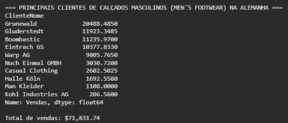

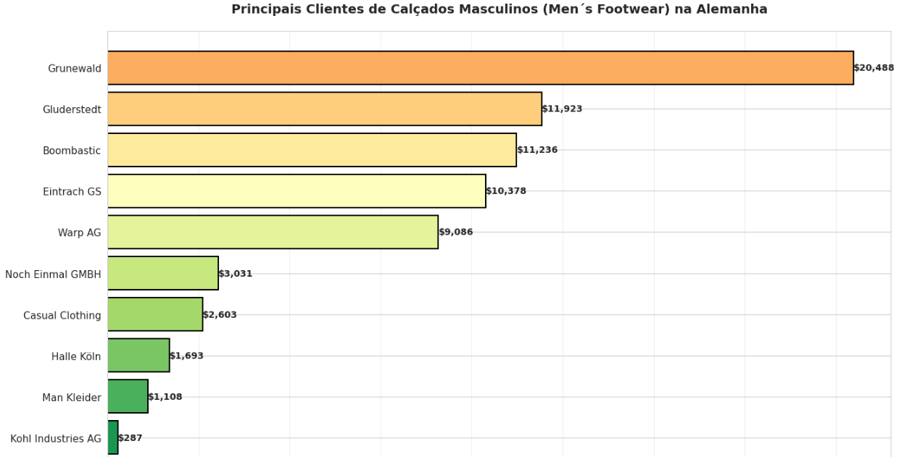

6. Quais os vendedores que mais dão descontos nos Estados Unidos?

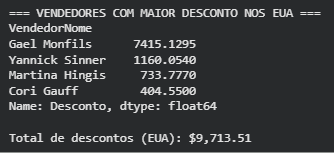

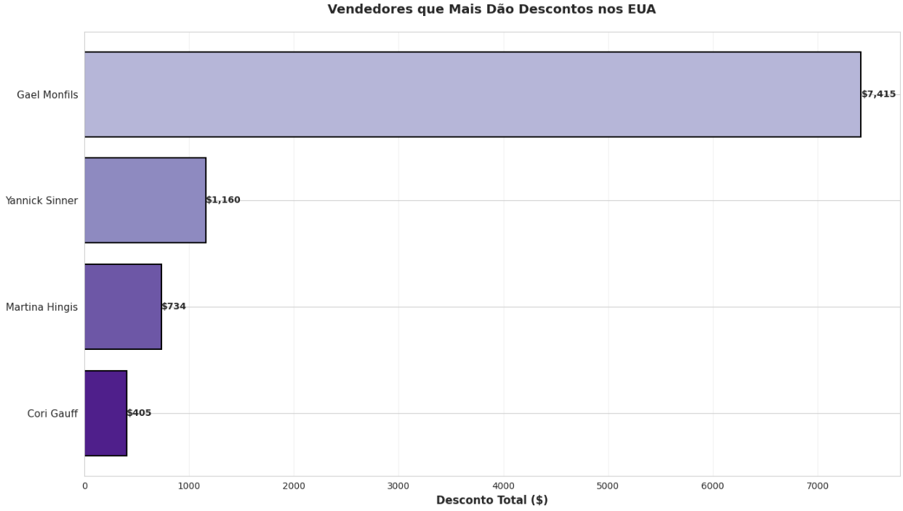

7. Quais os fornecedores que dão a maior margem de lucro ($) no segmento "Vestuário Feminino" (Womens wear)?

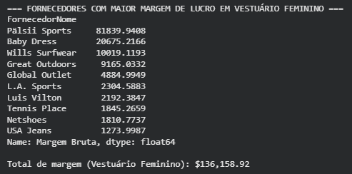

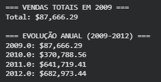

8. Quanto foi vendido ($) em 2009?

- Total vendido em 2009:

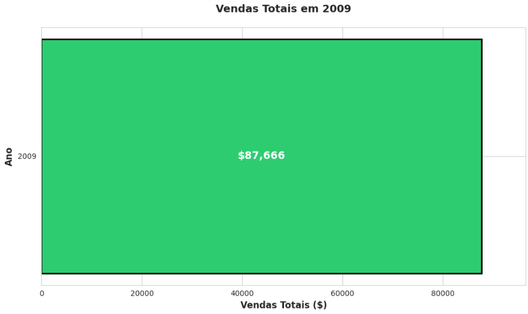

- Evolução anual 2009–2012
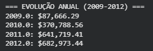

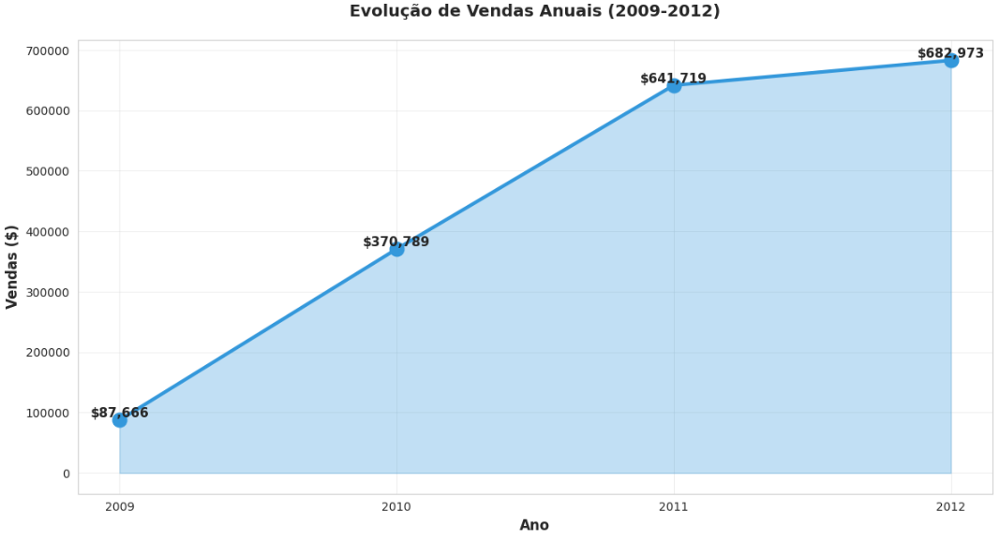

9. Quais são os principais clientes (vendas $) do segmento "Calçados Masculinos" (Men´s Footwear) no ano de 2013? Para quais cidades houve venda e quanto?

10. Na Europa, quanto se vende ($) para cada país?

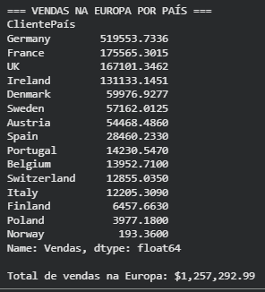

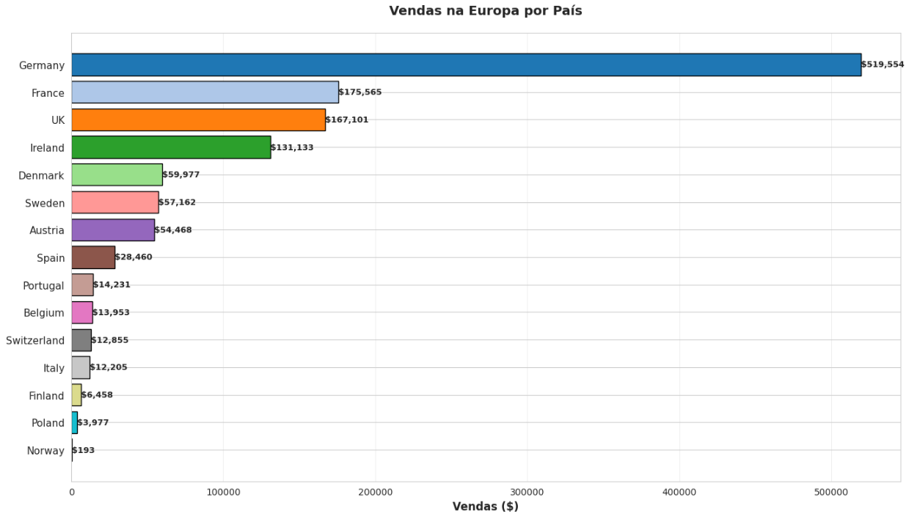

## 🌎 Links

- [Google Colab](https://colab.research.google.com/drive/1VCfmaUQHP78a231wBtjcuh5OVR2X5NCo?usp=sharing)

## 💁 Equipe

- Felipe Cartaxo
- Flávio Souza
- Jackson Ramos
- Sheila Lee
- Leidiana Patrício
